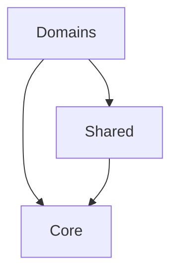

# Estrutura do Projeto

## Visão Geral

```
server/
├── src/
│   ├── core/              # Componentes fundamentais do sistema
│   ├── domains/          # Domínios de negócio
│   └── shared/           # Utilitários compartilhados
```

## 1. Core (`/src/core/`)

Contém as interfaces e tipos fundamentais que são a base de todo o sistema.

### 1.1 Interfaces (`/core/interfaces/`)
- `cache.interface.ts` - Interface para estratégias de cache
- `handler.interface.ts` - Interface para tratamento de erros
- `validator.interface.ts` - Interface para validação de dados
- `service.interface.ts` - Interface base para serviços
- `index.ts` - Arquivo de exportação das interfaces

**Propósito**: Definir contratos base que todo o sistema deve seguir, garantindo consistência e padronização.

## 2. Domains (`/src/domains/`)

Contém os diferentes domínios de negócio da aplicação, cada um com sua própria estrutura.

### 2.1 AI (`/domains/ai/`)
Domínio responsável pela integração com IA (Claude).

```
ai/
├── cache/              # Cache específico para IA
│   ├── interfaces/     # Contratos de cache
│   └── implementations/# Implementações (ex: MemoryCache)
├── handlers/           # Tratamento de erros da IA
│   ├── implementations/# Handlers específicos
│   └── __tests__/     # Testes dos handlers
├── validators/         # Validação de respostas da IA
│   ├── interfaces/     # Contratos de validação
│   └── implementations/# Validadores específicos
├── services/          # Serviços de IA
│   ├── ai.service.ts  # Serviço principal de IA
│   └── claude.service.ts # Integração com Claude
└── types/            # Tipos específicos de IA
```

### 2.2 Documentation (`/domains/documentation/`)
Domínio responsável pela gestão de documentação.

```
documentation/
├── services/         # Serviços de documentação
├── validators/       # Validadores de documentos
└── types/           # Tipos específicos
```

### 2.3 Projects (`/domains/projects/`)
Domínio responsável pela gestão de projetos.

```
projects/
├── services/        # Serviços de projeto
├── controllers/     # Controladores REST
└── types/          # Tipos específicos
```

## 3. Shared (`/src/shared/`)

Contém utilitários e helpers compartilhados entre domínios.

```
shared/
├── utils/          # Funções utilitárias
├── constants/      # Constantes globais
└── types/         # Tipos compartilhados
```

## Fluxo de Dependências



- Domínios podem depender do Core e Shared
- Shared pode depender do Core
- Core não deve depender de ninguém

## Princípios Organizacionais

1. **Core**
   - Contém apenas interfaces e tipos base
   - Não tem dependências externas
   - É a fundação do sistema

2. **Domains**
   - Cada domínio é independente
   - Pode ter sua própria estrutura interna
   - Segue os contratos definidos no Core

3. **Shared**
   - Código reutilizável entre domínios
   - Utilitários genéricos
   - Não contém lógica de negócio

## Exemplos de Uso

### 1. Serviço de IA
```typescript
// domains/ai/services/claude.service.ts
import { BaseService } from '@core/interfaces';
import { ClaudeValidator } from '../validators';
import { ClaudeErrorHandler } from '../handlers';

export class ClaudeService implements BaseService {
    // Implementação...
}
```

### 2. Cache
```typescript
// domains/ai/cache/implementations/memory.cache.ts
import { CacheStrategy } from '@core/interfaces';

export class MemoryCache implements CacheStrategy {
    // Implementação...
}
```

## Benefícios desta Estrutura

1. **Organização**
   - Código bem organizado e fácil de encontrar
   - Separação clara de responsabilidades
   - Fácil de manter e escalar

2. **Manutenibilidade**
   - Cada parte do sistema tem seu lugar
   - Mudanças são localizadas
   - Fácil de testar

3. **Escalabilidade**
   - Novos domínios podem ser adicionados facilmente
   - Interfaces base garantem consistência
   - Baixo acoplamento entre módulos 