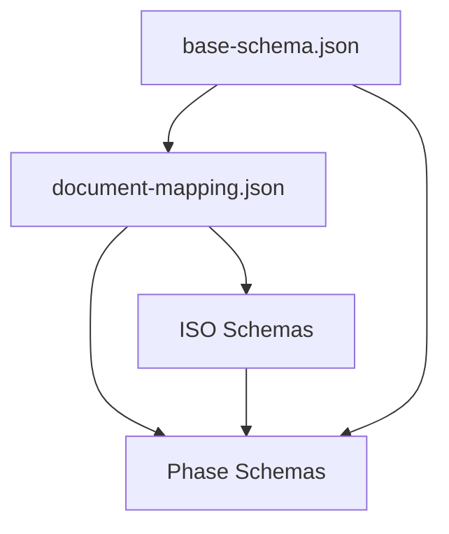

# Mapeamento de Dependências entre Schemas

## [2024-03-19 15:35] - Análise de Dependências

### 1. Core Schemas

#### 1.1 base-schema.json
- **Dependências Externas**:
  - JSON Schema draft-07
  - Formato Mermaid
- **Campos Principais**:
  - version (SemVer)
  - lastUpdate (Date)
  - metadata (Object)
  - content (Object)
  - diagrams (Object)
  - references (Array)
  - validation (Object)

#### 1.2 document-mapping.json
- **Dependências**:
  - base-schema.json (metadata)
  - ISO schemas (por fase)
- **Mapeamentos**:
  ```
  DVP → ISO/IEC 29110
  DRS → ISO/IEC 25010, 12207
  DAS → ISO/IEC 42010, 15026
  DADI → ISO/IEC 27001, 16085
  ```

### 2. ISO Schemas

#### 2.1 Dependências por Fase
- **DVP**:
  - ISO/IEC 29110
  - base-schema.json

- **DRS**:
  - ISO/IEC 25010
  - ISO/IEC 12207
  - base-schema.json

- **DAS**:
  - ISO/IEC 42010
  - ISO/IEC 15026
  - base-schema.json

- **DADI**:
  - ISO/IEC 27001
  - ISO/IEC 16085
  - base-schema.json

### 3. Phase Schemas

#### 3.1 DADI
- **Dependências**:
  - base-schema.json
  - document-mapping.json
  - ISO/IEC 27001
  - ISO/IEC 16085

- **Schemas**:
  1. document-control-schema.json (4.3KB)
  2. security-schema.json (7.8KB)
  3. containerization-schema.json (7.7KB)
  4. api-schema.json (9.2KB)
  5. monitoring-schema.json (9.6KB)
  6. prototypes-schema.json (11KB)
  7. development-environment-schema.json (12KB)
  8. infrastructure-schema.json (14KB)
  9. testing-schema.json (14KB)
  10. integrations-schema.json (17KB)
  11. data-architecture-schema.json (21KB)

## Grafo de Dependências



## Ordem de Migração Recomendada

1. **Core Base**
   ```
   base-schema.json → document-mapping.json → document-mapping-instance.json
   ```

2. **ISO Standards**
   ```
   ISO/IEC 29110 → ISO/IEC 25010 → ISO/IEC 12207 → ...
   ```

3. **Phases**
   ```
   DVP → DRS → DAS → DADI
   ```

## Validações Necessárias

1. **Por Schema**:
   - Validar contra JSON Schema draft-07
   - Verificar campos obrigatórios
   - Testar padrões regex

2. **Entre Schemas**:
   - Verificar referências
   - Validar herança
   - Testar resolução de caminhos

3. **Documentos**:
   - Testar com documentos existentes
   - Validar geração de novos documentos
   - Verificar compatibilidade 